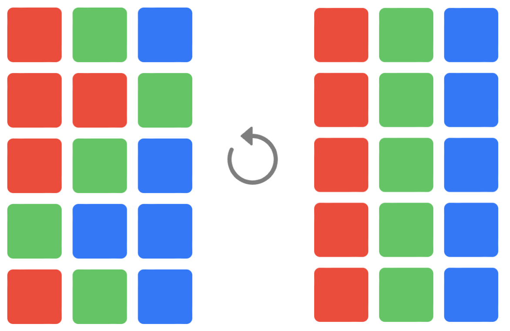

# Tactile - a Tile Permutation Game

TL;DR: [https://chrishinds.github.io/tactile/](https://chrishinds.github.io/tactile/)

Red green and blue tiles of equal numbers are placed on a 3x5 grid. Tiles' positions can be permuted by 8 operations: a shift up or down on any of three of the columns (with the top/bottom tile wrapping within that column), or the rotation of the grid's central square of 3x3 tiles either clockwise or counter-clockwise (referred to here as left and right, respectively). The "solution" is defined as the board state where the tiles form 3 neat columns of red, green, and blue, from left to right. The "game" is to take the board from a starting state, permute with a sequence of operations, and reach the solution state. Here's an example of a game with an initial state which can reach the solution using only a single operation:



A quick playable demonstrator for Tactile is provided in the `/play` folder. It's implemented in React and Typescript. You can play it on the github-pages link above.

# Simulation of Tactile Permutations in Golang

It's fairly easy to think up permutation puzzle variants, but usually a bit harder to work out how difficult they are. 
Brute force simulations aren't necessarily clever, but as a way of learning golang for a week or so around Xmas 2023, it was fun.
There was nothing particularly special about 3x5, 3 colours of tile, or the above operations, but since this is a brute force simulation it seemed reasonable to keep things small. 
The game is defined in [simulate/simple3x5.go](simulate/simple3x5.go). The simulation is in [simulate/data.go](simulate/data.go). 

It can be run with `go run data.go simple3x5.go`. But here's a walk through of `main()`:

## Board state reachability 
```go
treeDepth := simple3x5.calculateReachability(-1)
fmt.Printf("%v  Number of board States: %d\n", now(), len(simple3x5.reachableStateIndex))
maxInputs := treeDepth - 1
reachabilityTreesByLen, stateCountAtReachabilityDepth := simple3x5.reachableStateIndex.reachabilityTreesByInputLen()
for i := 0; i <= maxInputs; i++ {
    fmt.Printf("At reachability depth %v there are %v unique states with at least %v minimal trees\n", i, stateCountAtReachabilityDepth[i], len(reachabilityTreesByLen[i]))
}
```
```
Number of board States: 756756
At reachability depth 0 there are 1 unique states with at least 1 minimal trees
At reachability depth 1 there are 2 unique states with at least 2 minimal trees
At reachability depth 2 there are 13 unique states with at least 14 minimal trees
At reachability depth 3 there are 64 unique states with at least 88 minimal trees
At reachability depth 4 there are 294 unique states with at least 394 minimal trees
At reachability depth 5 there are 1348 unique states with at least 1832 minimal trees
At reachability depth 6 there are 5760 unique states with at least 8268 minimal trees
At reachability depth 7 there are 22184 unique states with at least 33884 minimal trees
At reachability depth 8 there are 68904 unique states with at least 116774 minimal trees
At reachability depth 9 there are 160254 unique states with at least 311986 minimal trees
At reachability depth 10 there are 235674 unique states with at least 572316 minimal trees
At reachability depth 11 there are 183076 unique states with at least 561116 minimal trees
At reachability depth 12 there are 70368 unique states with at least 267920 minimal trees
At reachability depth 13 there are 8720 unique states with at least 45240 minimal trees
At reachability depth 14 there are 94 unique states with at least 700 minimal trees
```
We would expect there to be `15!/5!^3 = 756,756` ways to arrange our tiles on this board (ie board states). However, it is not naively clear that all such board states would be able to "reach" our solution using just the operations we've allowed. Working backward we can systematically explore which board states can be reached. Of course it turns out we can reach all 756,756 states in this game, but this won't be true for all game variants. 

The reachable state set provides the potential game starting states. It is also useful to consider how difficult the solution might be to find from each state by considering the minimum length of a sequence of operations which might reach it. For this game the longest minimum input sequences have length 14, and there are apparently 94 different starting board states from which such sequences to the solution exist.

Here's an example of a board state reachable in 8 operations:
```go
exampleTree := reachabilityTreesByLen[8][0]
simple3x5.printStatesForTree(exampleTree)
```
```
   left ->   down1 ->  right ->  up3 ->    right ->  up1 ->    down2 ->  down3 ->
RGB       RGB       RGB       RGB       RGB       RGB       BGB       BGB       BGB
RGB       RRR       RRR       RGB       RGB       BGB       GGB       GGB       GGB
RGB       GGG       RGG       RGB       RGG       GGR       RGR       RGR       RGB
RGB       BBB       GBB       RRG       RRB       RRR       BRR       BGR       BGR
RGB       RGB       BGB       BGB       BGB       BGB       RGB       RRB       RRR
 |                                                                               |
 ^-- solution state         working backwards to reach        a starting state --^
```

## Simulating sequences of operations

The above establishes the reachable states but it doesn't exhaustively search all the input sequences, and even though it records multiple minimum reaching trees, these are not a complete list of all minimal trees capable of reaching a state, let alone all the possible non-minimal trees. However, with increasing sequence length calculation space and time are likely to balloon, for example, there are 8^10 = 1.07 Billion input sequences of length 10. 

We will tackle this complexity in two ways. Firstly we will calculate sequences for only a single starting board state (the one above). Secondly we will not exhaustively calculate all possible operation sequences, but rather proceed by simulating the outcome of a fixed number of random operation sequences. 

The simulation will not be entirely naive, it will not make moves which fail to change the board's state, and it will not loop, ie it will stop a sequence of operations once it reaches a board state already seen during that sequence. It will keep simulating input operations until the given maximum sequence length, although it may also find solutions which are shorter. Finally, because it's random, it may find a different number of solutions on each run. 

```go
simple3x5.buildGraph()
simulationIterations := 10000000
fmt.Printf("Simulating with %d iterations...\n", simulationIterations)
for length := 3; length <= 12; length++ {
    solutionCount, loopCount, unfinishedCount := simple3x5.simulateInputs(exampleTree.currentStateHash, length, simulationIterations)
    fmt.Printf("At input sequence length %v: %v solutions, %v looped sequences, %v unfinished sequences\n", length, solutionCount, loopCount, unfinishedCount)
}
```
```
Simulating with 10000000 iterations...
At input sequence length 3: 0 solutions, 1248164 looped sequences, 8751836 unfinished sequences
At input sequence length 4: 0 solutions, 2343519 looped sequences, 7656481 unfinished sequences
At input sequence length 5: 0 solutions, 3368260 looped sequences, 6631740 unfinished sequences
At input sequence length 6: 0 solutions, 4246095 looped sequences, 5753905 unfinished sequences
At input sequence length 7: 0 solutions, 5022722 looped sequences, 4977278 unfinished sequences

[up2 down1 up3 left down3 left up1 right]
[down1 up2 up3 left down3 left up1 right]
At input sequence length 8: 2 solutions, 5690541 looped sequences, 4309457 unfinished sequences

[up2 up3 down1 left down3 left up1 right]
[up3 up2 down1 left down3 left up1 right]
[up2 down1 up3 left down3 left up1 right]
[up2 up3 down1 left down3 left up1 right]
[up2 down1 up3 left down3 up1 right down3 left]
At input sequence length 9: 5 solutions, 6272442 looped sequences, 3727553 unfinished sequences

[up2 up3 down1 left down3 left up1 right]
[down1 up3 up2 up3 right up1 left down3 left]
[up2 left up3 down1 right right down3 up1 down3 left]
[up3 down1 up2 left up1 down3 down1 left up1 right]
[up3 up2 down1 left down3 left up1 right]
[up2 down1 up3 left down3 left up1 right]
[down1 up2 up3 left down3 left up1 right]
At input sequence length 10: 7 solutions, 6775618 looped sequences, 3224375 unfinished sequences

[down3 down1 up2 up3 up3 left down3 left up1 right]
[down1 up2 up3 left down3 left up1 right]
[down1 up2 up3 up3 right up1 left down3 left]
[down1 up3 up2 left down3 left up1 right]
[down1 right down2 left up3 left left down2 up1 right]
[up2 down1 up3 left down3 left up1 right]
[left up2 down3 left down2 up3 right down1 up3 left]
[down1 up3 up2 left down3 left up1 right]
[up3 down1 up2 left down3 left up1 right]
[down1 up2 up3 left down3 left up1 right]
[down1 down3 down3 down3 up2 right up1 left down3 left]
[up2 down1 down3 down3 down3 right up1 left down3 left]
At input sequence length 11: 12 solutions, 7216423 looped sequences, 2783565 unfinished sequences

[left up2 down1 down3 right up3 right down3 down2 down3 right]
[up3 up2 down1 left down3 left up1 right]
[up1 down1 up2 up3 down1 left down3 left up1 right]
[up2 up3 down2 down1 up2 left down3 left up1 right]
[up2 up2 down3 down3 up2 left down3 left down1 up3 right right]
[down1 up2 up3 right up1 right up1 left up1 right right]
[up3 down1 up2 left down3 left up1 right]
[up3 up2 down1 left down3 up1 right down3 left]
[down1 up3 up2 left down3 left up1 right]
[up2 down1 up3 left down3 left up1 right]
[up2 up3 down2 up3 up2 down1 down3 left down3 left up1 right]
[down2 up3 down2 right up1 left up1 up3 up1 down3 left left]
[up3 down1 up2 left down3 left up1 right]
[down1 up3 up2 left down3 left up1 right]
At input sequence length 12: 14 solutions, 7592527 looped sequences, 2407459 unfinished sequences
```

## Checking answers

consider one of our length 8 answers `[up2 down1 up3 left down3 left up1 right]` and check these operations reach the solution from our chosen initial board state

```go
simple3x5.showPlay(map[Position]Tile{
    p15: tB, p25: tG, p35: tB,
    p14: tG, p24: tG, p34: tB,
    p13: tR, p23: tG, p33: tB,
    p12: tB, p22: tG, p32: tR,
    p11: tR, p21: tR, p31: tR,
}, []Input{
    up2, down1, up3, left, down3, left, up1, right,
})
```
```
BGB
GGB
RGB
BGR
RRR
-> up2
BGB
GGB
RGB
BRR
RGR
-> down1
RGB
BGB
GGB
RRR
BGR
-> up3
RGB
BGB
GGR
RRR
BGB
-> left
RGB
RGB
RGG
RRB
BGB
-> down3
RGB
RGB
RGB
RRG
BGB
-> left
RGB
RRR
RGG
GBB
BGB
-> up1
RGB
RRR
GGG
BBB
RGB
-> right
RGB
RGB
RGB
RGB
RGB
```
Here is another length 12:
```go
simple3x5.showPlay(map[Position]Tile{
		p15: tB, p25: tG, p35: tB,
		p14: tG, p24: tG, p34: tB,
		p13: tR, p23: tG, p33: tB,
		p12: tB, p22: tG, p32: tR,
		p11: tR, p21: tR, p31: tR,
	}, []Input{
		up2, up2, down3, down3, up2, left, down3, left, down1, up3, right, right,
	})
```
```
BGB
GGB
RGB
BGR
RRR
-> up2
BGB
GGB
RGB
BRR
RGR
-> up2
BGB
GGB
RRB
BGR
RGR
-> down3
BGR
GGB
RRB
BGB
RGR
-> down3
BGR
GGR
RRB
BGB
RGB
-> up2
BGR
GRR
RGB
BGB
RGB
-> left
BGR
BRG
GGR
BBR
RGB
-> down3
BGB
BRR
GGG
BBR
RGR
-> left
BGB
BGB
BGR
RGR
RGR
-> down1
RGB
BGB
BGR
BGR
RGR
-> up3
RGB
BGR
BGR
BGR
RGB
-> right
RGB
RRR
GGG
BBB
RGB
-> right
RGB
RGB
RGB
RGB
RGB
```
